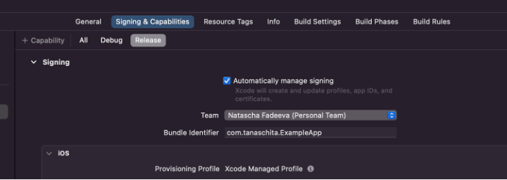

# iOS

The implementation for Flutter iOS is still very similar to native iOS with Swift, as there is no good Flutter SDK for
Passkeys / WebAuthn yet.

## Origin

Contrary to Android, the origin for WebAuthn doesn't require a specific format and is a regular URL,
e.g. `pro-xxx.auth.corbado.com`.

## Apple App Site Association (AASA)

To associate a native app with a web app, iOS requires an Apple App Site Association (AASA)
file `apple-app-site-association.json`. Use the following JSON
template and store it under `acme.com/.well-known/apple-app-site-association.json`:

```json
{
  "appclips": {
    "apps": []
  },
  "applinks": {
    "apps": []
  },
  "webcredentials": {
    "apps": [
      "{ APP_IDENTIFIER_PREFIX }.{ BUNDLE_IDENTIFIER }"
    ]
  }
}
```

Variables:

- `APP_IDENTIFIER_PREFIX`: The iOS app identifier prefix associated with your development team in your Apple Developer
  account (sometimes also referred to as TeamID).
- `BUNDLE_IDENTIFIER`: The bundle identifier associated with your iOS application. Can be found in Xcode development
  environment (someimtes also referred to as BundleID).

The following constraints must hold for the file:

- It must be publicly available, and not behind a VPN.
- It must be served with Content-type: application/json.
- It must be accessible over HTTPS.
- It must be served directly with an HTTP 200 response (no HTTP 300’s redirect).
- Ensure no robots TXT prevents it:
    - User-agent: *
    - Allow: /.well-known/

## Binding passkeys to your own domain

If you want to bind the passkeys to your own domain (e.g. `acme.com`), you need to manually change
the [WebAuthn relying party](https://www.w3.org/TR/webauthn-2/#webauthn-relying-party) and host
the [AASA](#apple-app-site-association-aasa) file on this domain (so
on `acme.com/.well-known/apple-app-site-association`).

## iOS native implementation

Apple offers
straight-forward [documentation](https://developer.apple.com/documentation/authenticationservices/public-private_key_authentication/supporting_passkeys)
for integrating passkeys in a native iOS app. Contrary to Android / Kotlin, there is no third party library necessary
for executing the WebAuthn / passkey requests to the WebAuthn server.

## iOS WKWebView implementation

Passkeys / WebAuthn in WKWebView only seem to work with native apps that have the web browser
entitlement [(source)](https://developer.apple.com/forums/thread/714785).

### Workaround: SFSafariViewController

You can redirect the browser to a prepared website or
via [SFSafariViewController](https://www.rfc-editor.org/rfc/rfc8252#appendix-B) (see [Android Custom Tabs](./android.md#workaround-2--android-custom-tabs) for Android).

## Native app linking

To link native iOS apps to web apps and allow intercepting links or accessing passwords stored in WebView Android
uses [AASA](./ios.md#apple-app-site-association--aasa-). To inform the iOS operating system and the native app
on which domains to look for AASA files you need to:

- Enable `Associated Domains` on your app identifier
- Enable `Associated Domains` under Signing and Capabilities (Xcode) and add your domain there (without https prefix,
  just the hostname)




[Source: Tanaschita](https://tanaschita.com/20220725-quick-guide-on-associated-domains-in-ios/)

- Beware: Starting with iOS 14 [AASA](#apple-app-site-association--aasa-) files are served from Apple CDN, cached and
  unregularly refreshed. This can be bypassed in developer mode (see [here](https://tanaschita.com/20220725-quick-guide-on-associated-domains-in-ios))
- In our case we need
    - `applinks`: allow native apps to open links
    - `webcredentials`: share credentials between web apps and native apps

The [AASA](#apple-app-site-association--aasa-) file itself has multiple sections. For us, only the `webcredentials` (
formerly access to keychain for user/password stored in browser, now also expanded to passkeys) and
the `applinks` (= [Universal Links](#universal-links)) section is
important [(see docs)](https://developer.apple.com/documentation/authenticationservices/connecting_to_a_service_with_passkeys).

Technically, only the `webcredentials` are needed to be able to exchange password and/or passkeys, but `applinks` need
to
be specified to intercept email magic links. The apps that are allowed to open them are
identified with a string like: `Y7L2DPA5Y5.com.corbado.passkeys` (TeamID.BundleID)
The string starts with the TeamID `Y7L2DPA5Y5`. It can be found in Apple's developer portal within the URL in the
browser or under Membership area in the App Developer Section on [https://developer.apple.com](https://developer.apple.com) (=TeamID)
and is then followed by
the `bundle identifier` (=bundleID) of the app as specified in
Xcode [(help for the SDK)](https://tanaschita.com/20230227-passkeys-ios-developer-guide).

### Custom URL schemes

They allow to work with any scheme without host specification. The only thing is that the scheme must be
unique: `your_scheme://any_host` or `corbado://any_host` (comparable
to [Deep Links](./android.md#deep-links) in Android).

### Universal Links

They only work with an https scheme and specified host, entitlements and
hosted [AASA](#apple-app-site-association--aasa-): `https://your_host` (comparable
to [Android App Links](./android.md#android-app-links) in Android).

